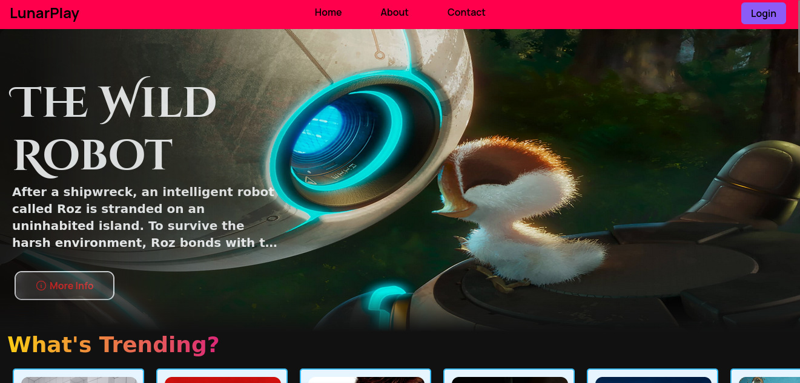
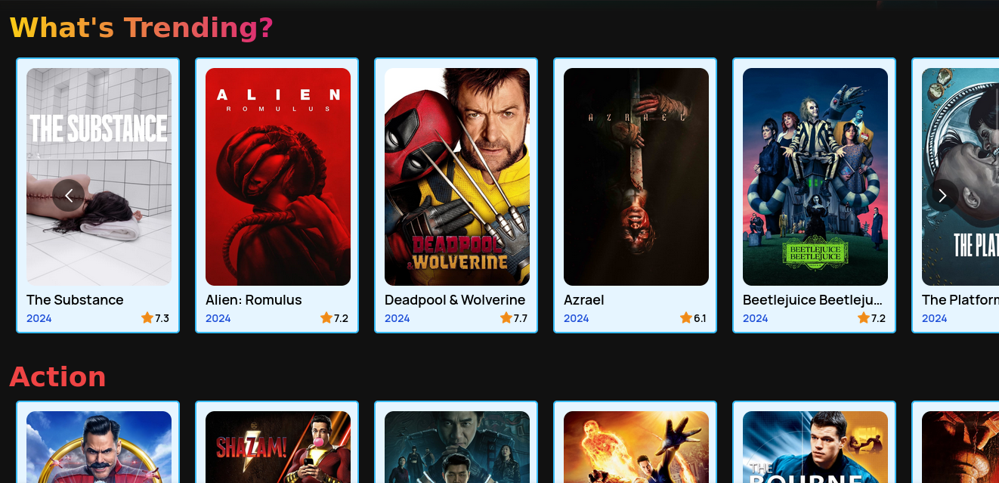
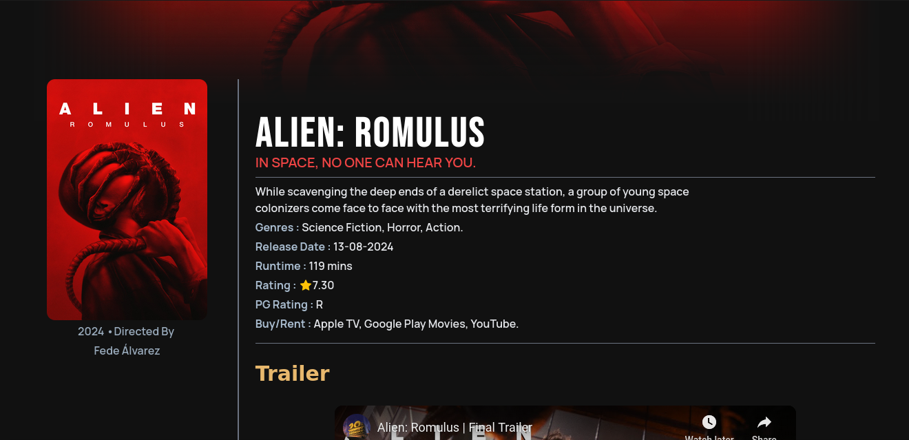
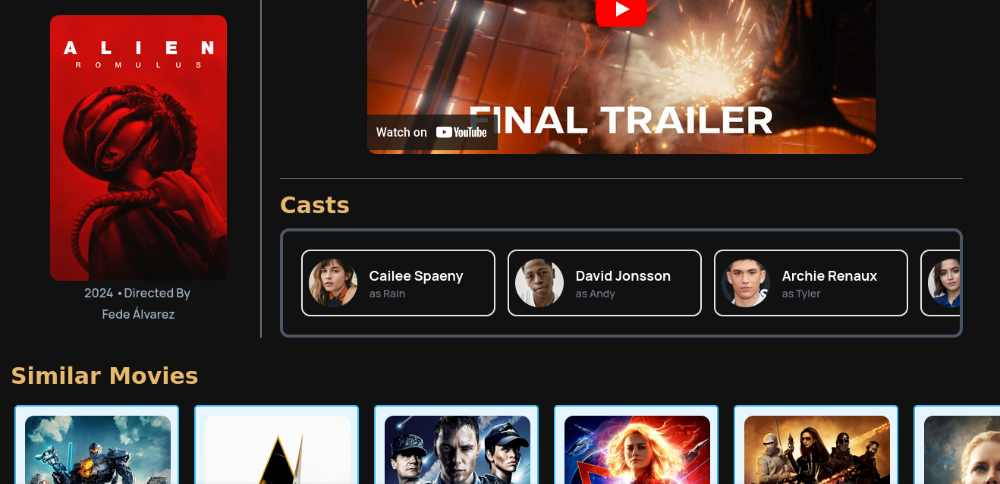

# Movie Discovery App

A web application that allows users to browse, search, and manage their favorite movies. Discover detailed information, ratings, and reviews to enhance your movie-watching experience.

## Table of Contents

- [Features](#features)
- [Installation](#installation)
- [Usage](#usage)
- [Contributing](#contributing)
- [License](#license)

## Features

- **Movie Recommendations**: Receive personalized movie recommendations based on your preferences.
- **View Movie Details**: Get comprehensive information about each movie, including ratings, genres, and reviews.
- **User-Friendly Interface**: Simple and intuitive layout for a seamless experience.

## Installation

To get started with the Movie Database App, follow these steps:

1. **Clone the repository**:
   ```bash
   git clone https://github.com/sudo-pacman-sy/LunarPlay.git
   ```
2. **Get your TMDB API key**

- Visit [TMDB](https://developer.themoviedb.org/docs/getting-started) and sign up for an account.
- Navigate to your account settings and find your API key.

3. **Create a .env file:**

- In the root directory of the project, create a .env file.
- Add your TMDB API key to the .env file:

  ```bash
  TMDB_KEY=your_api_key_here
  ```

4. **Install all dependencies:**

   ```bash
   npm install
   ```

5. **Run the project:**

   ```bash
   npm run dev
   ```

6. **Access the app:**

- Open your browser and navigate to `http://localhost:5173`

## Screenshots

- **HomePage**





- **Movie Details**





## Usage

Use the application to explore recommended movies and click on a movie to view detailed information.

## Contributing

Contributions are welcome! To contribute to the Movie Database App, fork the repository, create a new branch, make your changes, and commit them. After that, push to the branch and open a pull request.

## License

This project is licensed under the MIT License. See [LICENSE](LICENSE) for details.
